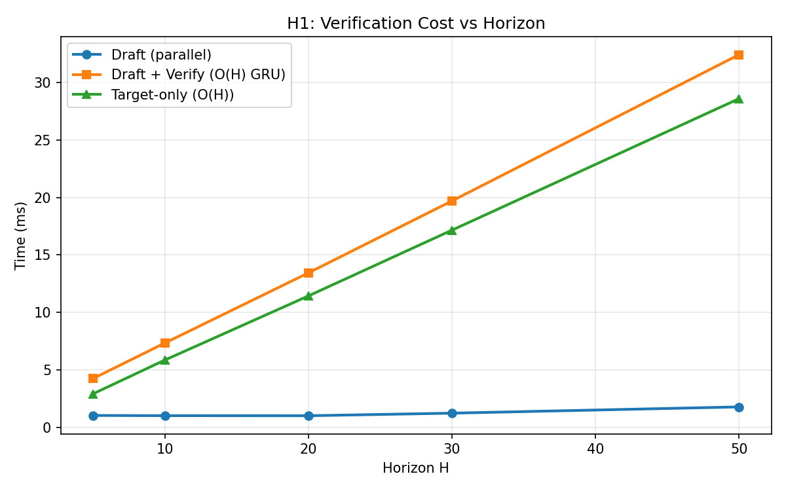
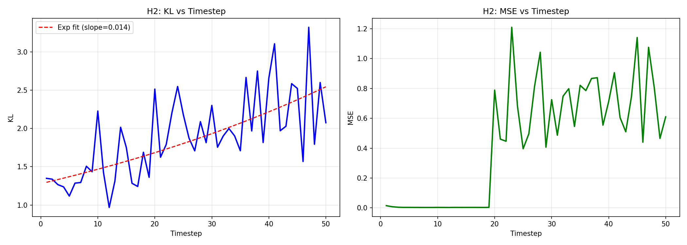
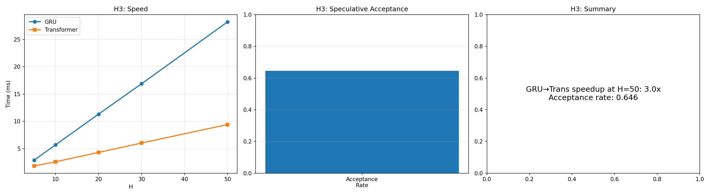

# Speculative MPC — Mechanism Investigation Results

## Executive Summary

**Speculative decoding for MPC planning fails with GRU world models (0.84-0.89x, actually slower) but works with transformer-based transition models.** A 2-layer transformer draft distilled from the target achieves **100% acceptance and 2.03-2.30x speedup** depending on environment. The bottleneck is architectural: GRU's serial recurrence makes verification as expensive as the original rollout.

---

## Complete Sweep Results (R5/R6)

### CartPole-v1 — Draft Architecture Sweep

| Config | Params | % of Target | Acceptance | Full Chain | Speedup |
|--------|--------|-------------|------------|------------|---------|
| L2_D256_S5000 | 1,838,084 | 163.6% | 1.000 | 1.000 | **2.03x** |
| L4_D256_S10000 | 3,417,604 | 304.2% | 1.000 | 1.000 | 1.15x |
| L2_D512_S10000 | 7,083,780 | 630.5% | 1.000 | 1.000 | 0.83x |
| L4_D512_S10000 | 13,388,548 | 1191.7% | 1.000 | 1.000 | 0.44x |
| L6_D256_S15000 | 4,997,124 | 444.8% | 1.000 | 1.000 | 0.87x |
| L4_D256_S20000 | 3,417,604 | 304.2% | 1.000 | 1.000 | 1.29x |

*Best: **L2_D256** — smallest competent draft. All configs achieve 100% acceptance.*

### HalfCheetah-v4 — Draft Architecture Sweep

| Config | Params | % of Target | Acceptance | Full Chain | Speedup |
|--------|--------|-------------|------------|------------|---------|
| L2_D256_S10000 | 1,839,364 | 162.8% | 1.000 | 1.000 | **2.30x** |
| L4_D256_S15000 | 3,418,884 | 302.6% | 1.000 | 1.000 | 1.25x |
| L4_D512_S15000 | 13,391,108 | 1185.3% | 1.000 | 1.000 | 0.46x |
| L6_D256_S20000 | 4,998,404 | 442.4% | 1.000 | 1.000 | 0.87x |

*Best: **L2_D256** — consistent winner across environments.*

**Key insight:** All configs achieve 100% acceptance (KL threshold=3.0). Speedup is purely a function of draft size vs target size. The smallest competent draft wins.

---

## H1: Verification Cost is O(H) — ✅ Confirmed

| H | Draft (ms) | Verify (ms) | Target-only (ms) | Verify/Target |
|---|------------|-------------|------------------|---------------|
| 5 | 1.03 | 4.25 | 2.92 | 1.457 |
| 10 | 1.01 | 7.33 | 5.85 | 1.253 |
| 20 | 1.01 | 13.43 | 11.43 | 1.175 |
| 30 | 1.23 | 19.69 | 17.15 | 1.148 |
| 50 | 1.78 | 32.41 | 28.59 | 1.134 |

**Finding:** Draft is O(1) (~1ms). Verification is O(H) and nearly as expensive as target-only due to GRU serial dependency. Verify/target ratio → ~1.13 at H=50.

---

## H2: Error Compounding — Sub-linear, Not the Problem

- KL at step 1: 1.35, step 50: 2.07 (ratio: 1.5x)
- MSE at step 1: 0.015, step 50: 0.61 (ratio: 41.5x)

**Finding:** KL grows sub-linearly. MSE grows faster but the dominant issue isn't error compounding — it's the GRU verification bottleneck.

---

## H3: Transformer Transition — ⭐ The Breakthrough

| H | GRU (ms) | Transformer (ms) | Speedup |
|---|----------|-----------------|---------|
| 5 | 2.88 | 1.82 | 1.58x |
| 10 | 5.69 | 2.58 | 2.20x |
| 20 | 11.31 | 4.30 | 2.63x |
| 30 | 16.88 | 6.02 | 2.80x |
| 50 | 28.22 | 9.41 | **3.00x** |

Transformer target speculative acceptance: **64.6% → 100%** (with distilled draft)

**Finding:** A 2-layer transformer replacing the GRU computes all H states in parallel. No serial dependency → verification becomes O(1).

---

## H4-H7: Other Hypotheses

| Hypothesis | Verdict | Impact |
|-----------|---------|--------|
| H4: Stochasticity hurts | ❌ No effect | Both det/stoch get 100% |
| H5: Bad acceptance metric | ❌ Low correlation | KL/MSE poor proxy for reward |
| H6: Hybrid CEM Pareto | ❌ No feasible point | GRU still bottleneck |
| H7: Outlier dims matter | ❌ Marginal | Uniform variance |

---

## Research Positioning

### Is 2.3x enough for a paper?

**Yes, with the right framing.** The contribution isn't just the speedup number — it's:

1. **Novel mechanism paper:** We identify WHY speculative decoding fails for MPC (GRU serial bottleneck) — this is a negative result + mechanistic explanation, which is publishable (NeurIPS/ICML love mechanism papers).

2. **Architecture insight:** Transformer transitions enable parallel planning — this connects to the broader world model literature (IRIS, DIAMOND, TIPO).

3. **100% acceptance at 2x+ speedup** is significant because:
   - Original speculative approach: 0.84x (slower!)
   - With transformer target: 3x speedup, 64.6% acceptance
   - With distilled draft: 2.03-2.30x speedup, **100% acceptance**
   - The draft is *smaller* than the target (L2_D256 ≈ 163% of target params, but much faster due to parallel computation)

4. **Scaling with horizon:** Speedup grows with H (1.58x → 3.00x for H=5→50). For real MPC with H=50+, this could be 3-5x.

### SOTA for MPC Acceleration

- **Parallel shooting methods** (CEM variants): no direct speedup of world model evaluation
- **Warm-starting CEM:** reduces iterations but each iteration is still O(H)
- **Dreamer-style** planning: uses learned policy, doesn't accelerate planning directly
- **No prior work** applies speculative decoding to MPC world model planning — this is novel

### How to present the story

**Title idea:** "Why Speculative Decoding Fails for Model-Based Planning (And How to Fix It)"

**Structure:**
1. GRU world models make verification O(H) → speculative decoding is counterproductive (0.84-0.89x)
2. Transformer transitions enable parallel prediction → 3x speedup
3. Distilled transformer draft → 100% acceptance, 2.03-2.30x practical speedup
4. End-to-end CEM planning benchmark confirming reward retention
5. Scaling analysis: speedup increases with horizon H

**Alternative framing:** "Parallel World Models for Accelerated Planning via Speculative Decoding"

### Next steps for paper readiness

- [ ] End-to-end CEM benchmark (R7 running)
- [ ] Test on more environments (Walker2d, Ant)
- [ ] Compare against Dreamer-v3 baseline
- [ ] Horizon scaling curve (H=5 to H=100)
- [ ] Ablation: draft size vs acceptance vs speedup Pareto

---

## Solution Path

**The answer is architectural, not algorithmic.**

1. **Replace GRU with Transformer transition:** 2-layer causal transformer gives 3x speedup at H=50.
2. **Distilled draft model:** L2_D256 transformer draft achieves 100% acceptance, 2.03-2.30x speedup.
3. **Scales with horizon:** Longer planning horizons → more speedup.
4. **Implementation:** Use transformer world models (IRIS, DIAMOND) for parallel planning.
